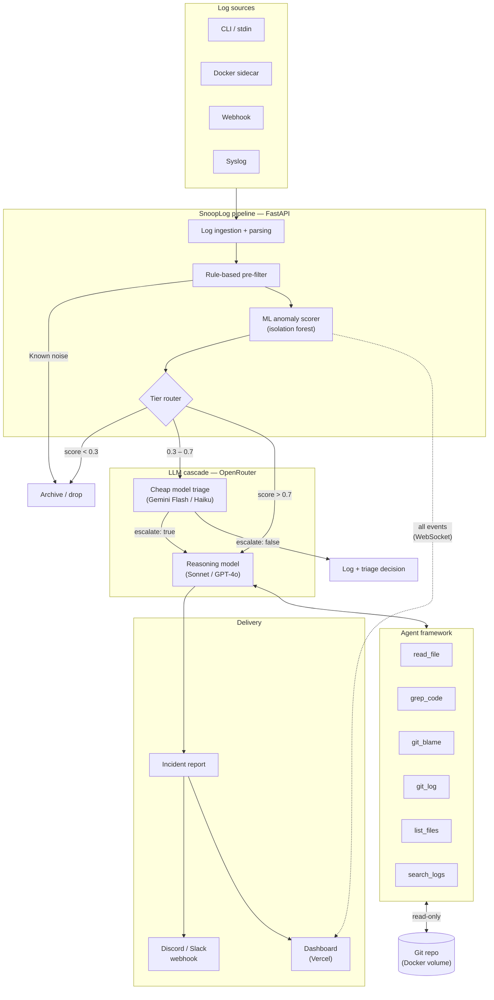
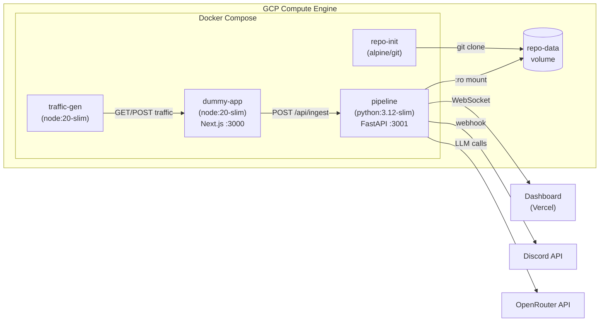
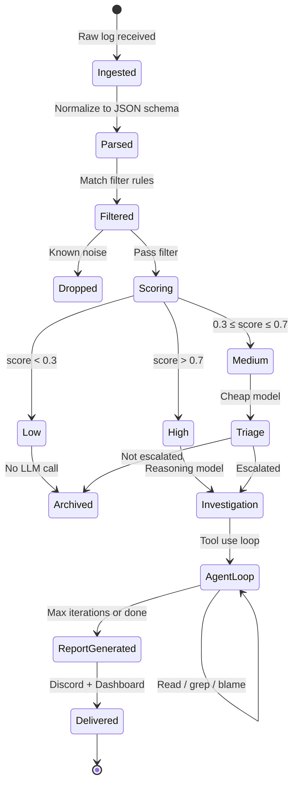
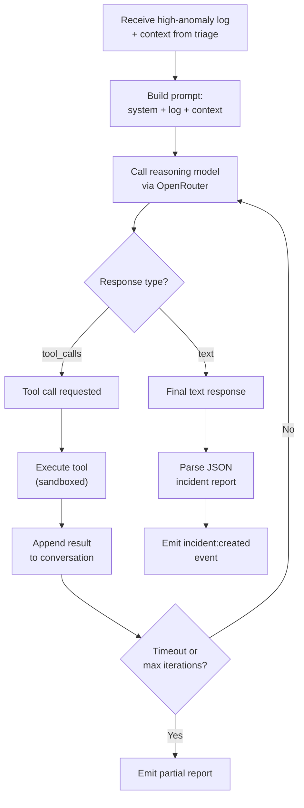
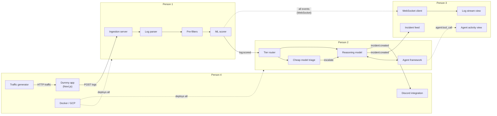
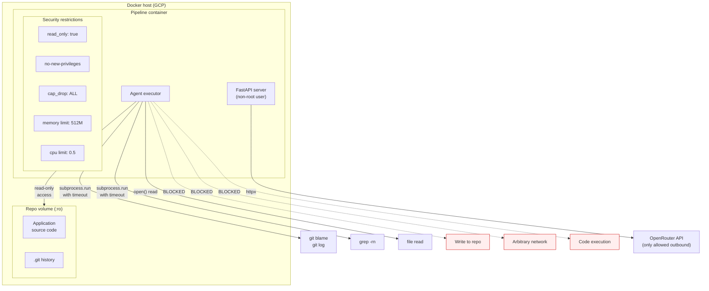

# SnoopLog — System Architecture Diagrams

## 1. High-level pipeline flow

## 2. Docker Compose service topology

## 3. Log event lifecycle (state machine)

## 4. Agent investigation loop

## 5. Data flow between team tracks

## 6. Security and isolation model

